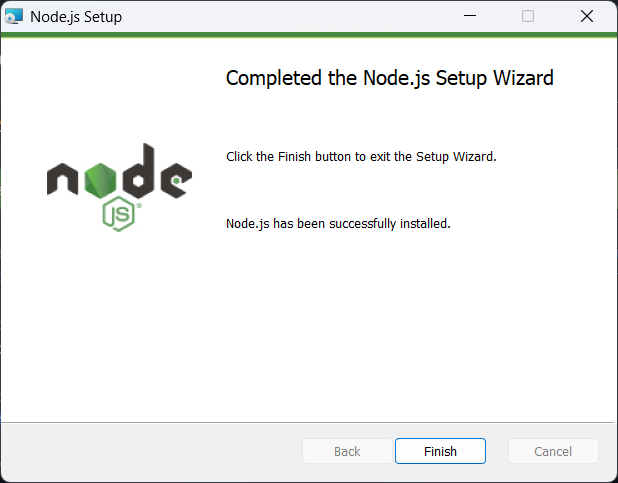
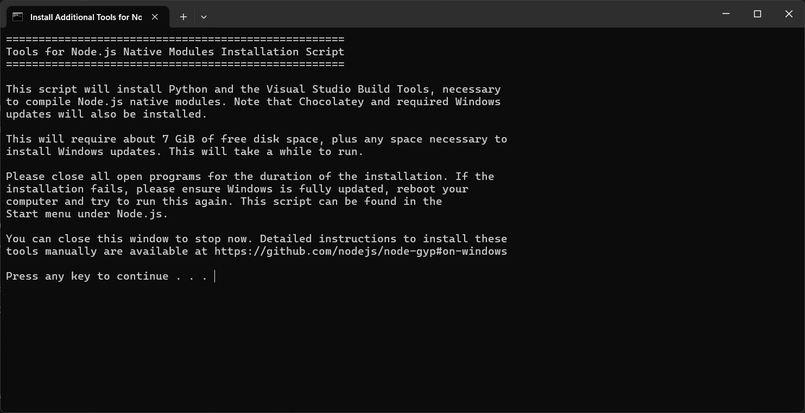
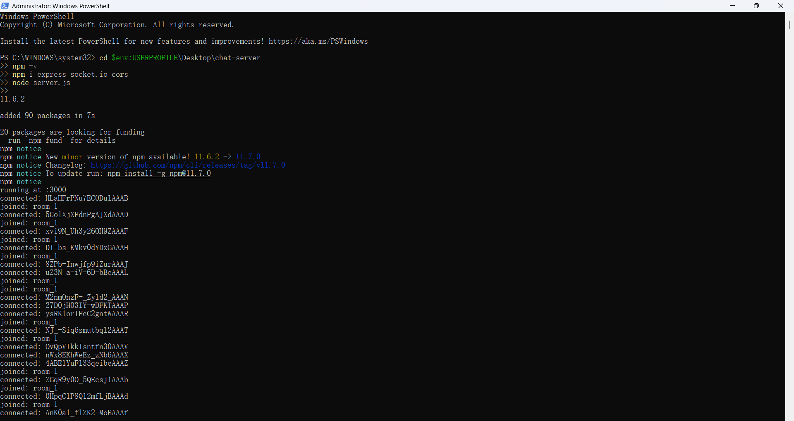
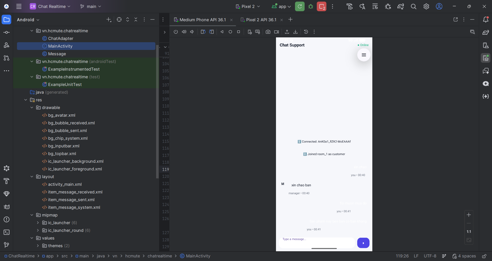
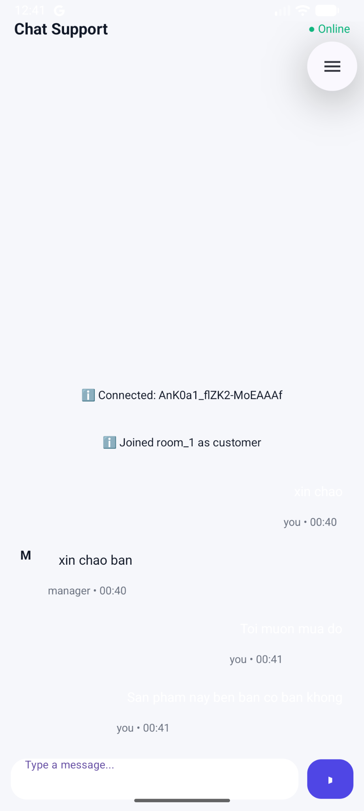
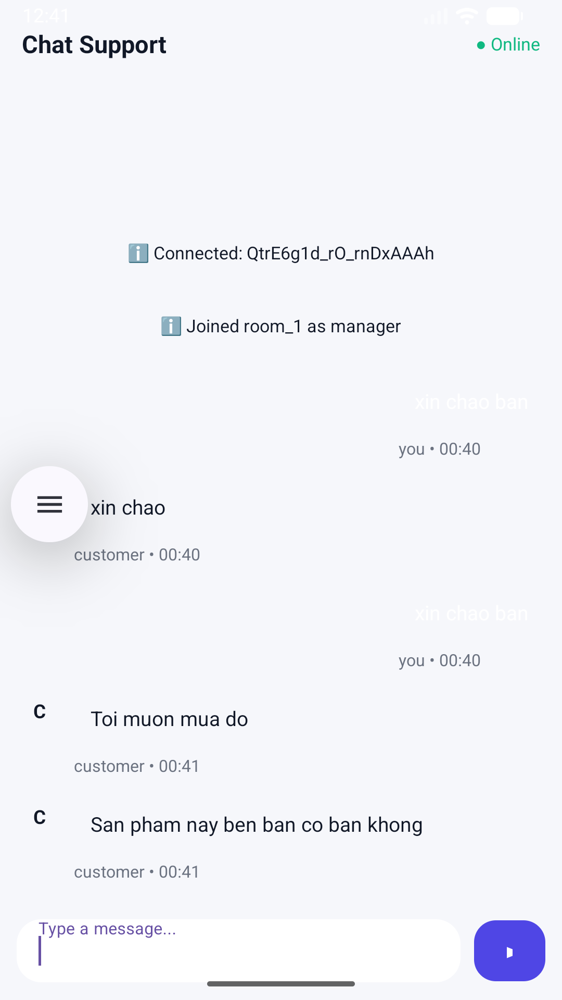

# Chat Realtime – Screenshots

> All screenshots are stored in `docs/screenshots`

---

## Install Node.js

---

## Setup Node.js Environment

---

## Socket.IO Server Running (Port 3000)

---

## Two Devices Connected (Customer & Manager)

---

## Customer View

---

## Manager View

